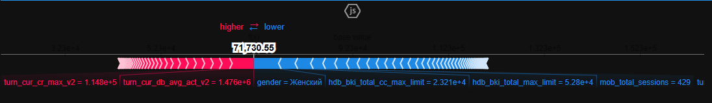
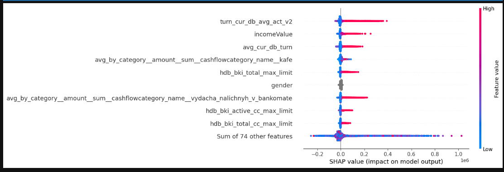
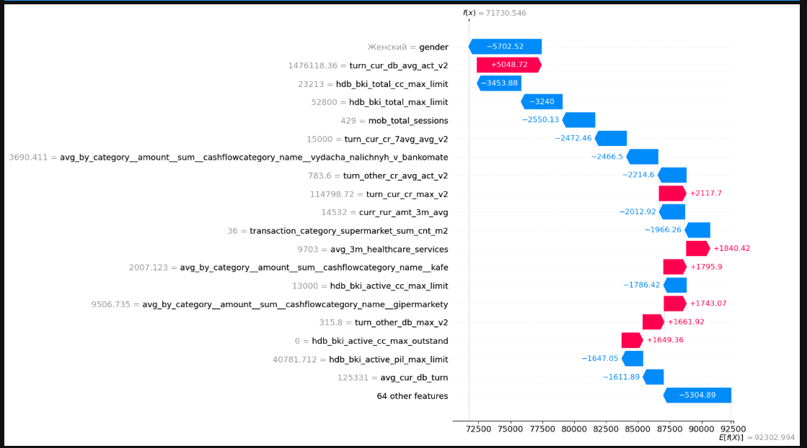
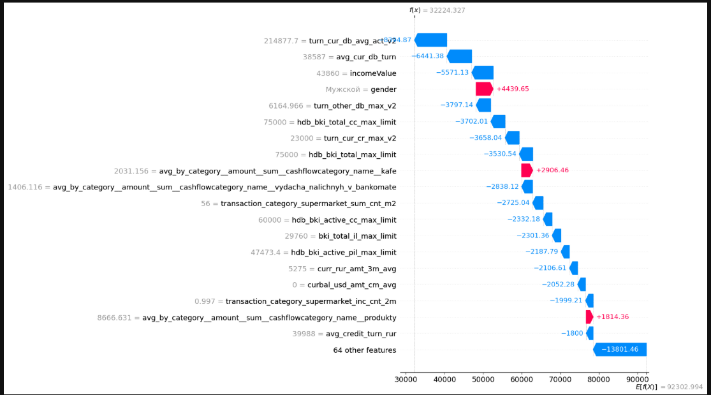
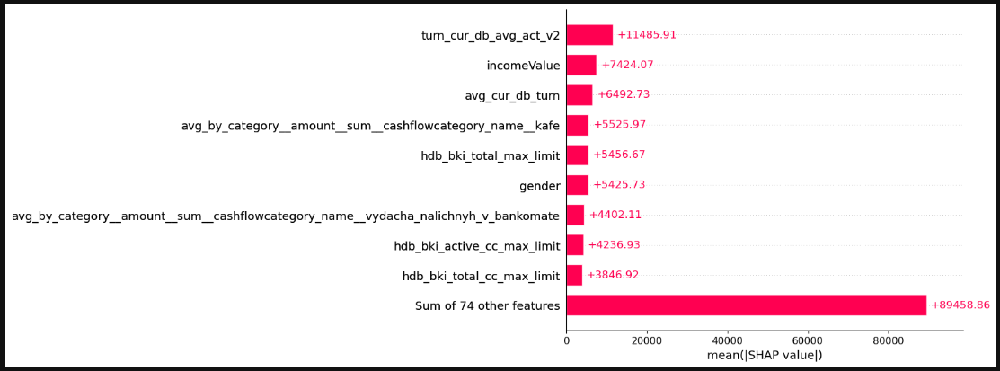

# Alpha Hackathon — Income Prediction Baseline

A machine learning pipeline for predicting income using gradient boosting models (XGBoost and CatBoost), developed as a hackathon baseline solution. The notebook covers the full ML workflow: data exploration, preprocessing, feature engineering, model training, hyperparameter tuning, and SHAP-based interpretability.

---


---

## Table of Contents

- [Project Overview](#project-overview)
- [Dataset](#dataset)
- [Requirements](#requirements)
- [Project Structure](#project-structure)
- [Pipeline Walkthrough](#pipeline-walkthrough)
  - [1. Data Loading & Exploration](#1-data-loading--exploration)
  - [2. Data Preprocessing](#2-data-preprocessing)
  - [3. Feature Engineering & Reduction](#3-feature-engineering--reduction)
  - [4. Model Training](#4-model-training)
  - [5. Hyperparameter Tuning](#5-hyperparameter-tuning)
  - [6. Model Interpretability (SHAP)](#6-model-interpretability-shap)
- [Evaluation Metric](#evaluation-metric)
- [Model Results Summary](#model-results-summary)
- [Best Model & Saved Artifacts](#best-model--saved-artifacts)
- [Key Design Decisions](#key-design-decisions)
- [Known Issues & Limitations](#known-issues--limitations)

---

## Project Overview

This notebook builds and evaluates multiple regression models to predict income from a structured dataset containing numerical and categorical features. The primary competition metric is **Weighted Mean Absolute Error (WMAE)**, where each sample carries a weight `w`. Several combinations of preprocessing strategies and algorithms are benchmarked to find the best-performing configuration.

---

## Dataset

| File                         | Description                                                                        |
| ---------------------------- | ---------------------------------------------------------------------------------- |
| `hackathon_income_train.csv` | Training data including `target` (income) and sample weights `w`                   |
| `hackathon_income_test.csv`  | Test data without `target` or `w` columns                                          |
| `features_description.csv`   | Human-readable descriptions for each feature (CP1251 encoded, semicolon-delimited) |

**Format:** semicolon-delimited (`;`), comma as decimal separator.

The training set has 2 more columns than the test set: `target` and `w`.

---

## Requirements

Install dependencies via pip:

```bash
pip install pandas numpy matplotlib seaborn scikit-learn xgboost catboost shap joblib
```

| Library                 | Purpose                                                       |
| ----------------------- | ------------------------------------------------------------- |
| `pandas`, `numpy`       | Data manipulation                                             |
| `matplotlib`, `seaborn` | Visualization                                                 |
| `scikit-learn`          | Preprocessing, train/test split, imputation, cross-validation |
| `xgboost`               | Gradient boosted trees (XGBoost)                              |
| `catboost`              | Gradient boosted trees with native categorical support        |
| `shap`                  | Model interpretability and feature attribution                |
| `joblib`                | Model serialization                                           |

---

## Project Structure

```
.
├── Alpha-Hackathon.ipynb        # Main notebook
├── hackathon_income_train.csv   # Training data
├── hackathon_income_test.csv    # Test data
├── features_description.csv     # Feature metadata
├── prototype_cat.joblib         # Saved best model (CatBoost)
├── model_features_cat.json      # Feature list used by the saved model
└── README.md
```

---

## Pipeline Walkthrough

### 1. Data Loading & Exploration

The data is loaded with semicolon delimiters and comma decimal separators. An initial exploration step confirms:

- The training set has 2 extra columns over the test set: `target` and `w`.
- Features are split into **numerical** and **categorical** groups using `select_dtypes`.
- Missing data percentages are computed and sorted for each feature.

### 2. Data Preprocessing

**Step 1 — Drop high-missingness features:**  
Columns where more than 50% of values are missing are dropped entirely. This reduces noise and prevents imputation from dominating signal.

**Step 2 — Drop non-informative columns:**  
`dt` (datetime) and `id` are removed as they do not contain learnable patterns.

**Step 3 — Fix misclassified dtypes:**  
Columns prefixed with `hdb_` or `bki_` are stored as objects (strings) in the raw CSV but are actually numeric. These are coerced to numeric with `pd.to_numeric(..., errors='coerce')`.

**Step 4 — Handle missing values in numerical features:**  
A `KNNImputer` with `n_neighbors=5` is used to fill remaining missing values in numerical columns. This is preferred over simple mean/median imputation as it preserves local data structure.

**Step 5 — Handle categorical features:**

- High-cardinality columns (`city_smart_name`, `adminarea`) are frequency-encoded: each category value is replaced by its relative frequency in the training set.
- Lower-cardinality columns (`addrref`, `gender`) are retained as-is.
- Remaining categoricals are cast to the `category` dtype for XGBoost/CatBoost compatibility.
- For CatBoost, all categorical columns are cast to string with `NaN` filled as `'MISSING'`.

### 3. Feature Engineering & Reduction

A three-step dimensionality reduction pipeline is applied to the numerical features:

**Step 1 — Variance threshold:**  
Features with variance below `0.01` are removed (near-constant features provide no predictive signal).

**Step 2 — Correlation filtering:**  
Using the upper triangle of the Pearson correlation matrix, features with pairwise correlation above `0.85` are identified and one of each pair is dropped (retaining the one that appears earlier in the column order).

**Step 3 — XGBoost feature importance:**  
A lightweight XGBoost model (`n_estimators=100`) is trained on the remaining features. Features are ranked by importance and only those contributing to the top 95% of cumulative importance are retained.

This pipeline reduces the 134 original numerical features to a compact, 80 high-signal subset.

### 4. Model Training

Five XGBoost variants and three CatBoost variants are trained, each representing a different combination of preprocessing choices:

| Variant       | Numerical Features                               | Categorical Features     |
| ------------- | ------------------------------------------------ | ------------------------ |
| Model 1 (XGB) | KNN-filled-missing-data + reduced dimentionality | Default (category dtype) |
| Model 2 (XGB) | Not filled missing data + reduced dimentionality | Default                  |
| Model 3 (XGB) | Not filled missing data + reduced dimentionality | Frequency-encoded        |
| Model 4 (XGB) | KNN-filled-missing-data + reduced dimentionality | Frequency-encoded        |
| Model 5 (CAT) | KNN-filled-missing-data + reduced dimentionality | Default (native)         |
| Model 6 (CAT) | Not filled missing data + reduced dimentionality | Default                  |
| Model 7 (CAT) | KNN-filled-missing-data + reduced dimentionality | Frequency-encoded        |

All models use an 80/20 train/validation split (`random_state=42`). The weight column `w` is extracted from the validation split to compute WMAE but is not passed as a training feature.

**XGBoost base configuration:**

```python
xgb.XGBRegressor(
    enable_categorical=True,
    n_estimators=1000,
    max_depth=7,
    eta=0.1,
    subsample=0.7,
    colsample_bytree=0.8
)
```

**CatBoost base configuration:**

```python
cb.CatBoostRegressor(
    iterations=2000,
    depth=8,
    learning_rate=0.05,
    subsample=0.8,
    colsample_bylevel=0.7,
    l2_leaf_reg=3,
    random_strength=2,
    min_data_in_leaf=5,
    max_bin=512,
    grow_policy="SymmetricTree",
    boosting_type="Plain",
    bagging_temperature=0.5
)
```

### 5. Hyperparameter Tuning

`RandomizedSearchCV` with 5-fold cross-validation and 20 random iterations is applied to CatBoost over the following search space:

| Parameter             | Values                              |
| --------------------- | ----------------------------------- |
| `iterations`          | 500, 1000, 1500, 2000               |
| `depth`               | 4, 6, 8, 10, 12                     |
| `learning_rate`       | 0.01, 0.03, 0.05, 0.1, 0.15         |
| `l2_leaf_reg`         | 1, 3, 5, 7, 9                       |
| `random_strength`     | 0.5, 1, 2, 3                        |
| `bagging_temperature` | 0, 0.5, 1, 2                        |
| `subsample`           | 0.6–1.0                             |
| `colsample_bylevel`   | 0.6–1.0                             |
| `min_data_in_leaf`    | 1, 3, 5, 10, 20                     |
| `max_bin`             | 128, 254, 512                       |
| `grow_policy`         | SymmetricTree, Depthwise, Lossguide |
| `boosting_type`       | Ordered, Plain                      |

**Best parameters found:**

```
iterations: 2000 | depth: 8 | learning_rate: 0.05 | l2_leaf_reg: 3
subsample: 0.8   | colsample_bylevel: 0.7 | random_strength: 2
min_data_in_leaf: 5 | max_bin: 512 | grow_policy: SymmetricTree
boosting_type: Plain | bagging_temperature: 0.5
Best RMSE: 47748.47
```

### 6. Model Interpretability (SHAP)

SHAP (SHapley Additive exPlanations) values are computed using `shap.TreeExplainer` on the best CatBoost model. The following visualizations are produced:

- **Force plot** — explains an individual prediction by showing how each feature pushes the output above or below the base value.
- <a id="my-anchor">**Beeswarm plot**</a> — shows the distribution of SHAP values for all features across all samples, revealing both magnitude and direction of impact.
- **Waterfall plot** — step-by-step breakdown of a single prediction.
- <a id="my-anchor-1">**Bar plot**</a> — global feature importance ranked by mean absolute SHAP value.

The top 10 features that strongly influnces the decision of the model are printed with their description from `features_description.csv` and a label indicating whether they **INCREASE** or **DECREASE** the predicted income.

- "turn_cur_db_avg_act_v2": Average current debit turnover on current accounts for 12 months
- incomeValue: Client's income value
- "avg_cur_db_turn": Average debit turnover on current accounts for 3 months
- "avg_by_category_amount\_\_sum_cashflowcategory_name_kafe": The average amount of transactions in the Cafe category per month throughout the year
- "hdb_bki_total_max_limit\_\_БКИ": The maximum credit limit for any product for all time
- gender: Customer's gender
- "avg_by_category_amount_sum_cashflowcategory_name_vydacha_nalichnyh_v_bankomate": The average amount of transactions in the ATM Cash withdrawal category per month throughout the year
- "hdb_bki_active_cc_max_limit": БКИ: The maximum limit on an active credit product is a credit card
- "hdb_bki_total_cc_max_limit": БКИ: Maximum credit product limit Credit Card for all time
- "transaction_category_supermarket_inc_cnt_2m": The number of transactions in the Supermarket category over the past 2 months divided by the average Number of transactions in this category over 2 months (throughout the year)

Force plot

This graph demonstrates, how each feature contributed to predicting an income of 71,730.55 for this customer.
The base value is equivalent to - 92302.994

Beeswarm plot

Reference - [Beeswarm explanation](#my-anchor)

WaterFall plot



These graphs show similar interpretation as Force plot, showcasing the value each feature adds or subtracts from the base line value.
For client A - Because the gender of a client is a woman, the model predicted less(NB: my model is not sexist, it just preidcts based on patterns found from the training data)

Barplot

Reference - [Barplot explanation](#my-anchor-1)

---

## Evaluation Metric

The competition uses **Weighted Mean Absolute Error (WMAE)**:

```python
def weighted_mean_absolute_error(y_true, y_pred, weights):
    return (weights * np.abs(y_true - y_pred)).mean()
```

Lower WMAE is better. The weight `w` is provided in the training set and extracted from the validation split before training.

---

## Model Results Summary

Models sorted by WMAE (ascending — lower is better):

| Model                                                                  | MSE           | R²     | WMAE       |
| ---------------------------------------------------------------------- | ------------- | ------ | ---------- |
| **cat_model_final** (CatBoost, filled num + freq-encoded cat)          | 4,641,102,477 | 0.6536 | **37,191** |
| model_cat_full (CatBoost, filled num + default cat)                    | 4,684,569,918 | 0.6504 | 37,435     |
| model_xg_filled_encoded_cat (XGB, filled num + freq-encoded cat)       | 4,943,762,996 | 0.6310 | 37,903     |
| model_xg_filled (XGB, filled num + default cat)                        | 5,251,660,118 | 0.6081 | 39,452     |
| model_missing_numerical (CatBoost, unfilled num + default cat)         | 6,221,519,423 | 0.5357 | 45,124     |
| model_encoded_cat_notfilled_num (XGB, unfilled num + freq-encoded cat) | 6,599,035,286 | 0.5075 | 46,363     |
| model_combined_missing (XGB, unfilled num + default cat)               | 6,727,692,814 | 0.4979 | 46,984     |

**Key takeaways:**

- KNN imputation of missing numerical values consistently improves performance.
- CatBoost outperforms XGBoost across all comparable configurations.
- Frequency encoding of high-cardinality categoricals provides a marginal gain for CatBoost, but the difference is smaller when native categorical handling is used.

---

## Best Model & Saved Artifacts

The best model (`cat_model_final`) is saved for reuse:

```python
import joblib, json

# Load model
model = joblib.load('prototype_cat.joblib')

# Load required features
with open('model_features_cat.json') as f:
    features = json.load(f)
```

The `model_features_cat.json` file contains the exact list of numerical feature names selected during dimensionality reduction, which must be present in any new data passed to the model.

---

## Key Design Decisions

- **KNN Imputation over simple imputation:** Preserves feature relationships and generally improves downstream model accuracy.
- **Three-step feature reduction:** Removes variance-less, redundant, and unimportant features without manual selection — fully automated and reproducible.
- **CatBoost for categorical handling:** Avoids the information loss from one-hot encoding by handling categoricals natively, which is especially beneficial with high-cardinality columns like `city_smart_name` and `adminarea`.
- **Frequency encoding as an alternative:** For models that require numeric inputs, frequency encoding provides a compact, ordinal-free representation.
- **Weight-aware evaluation:** WMAE is used rather than plain MAE to respect the competition's sample weighting scheme. Weights are withheld from the model to avoid data leakage.

---

## Known Issues & Limitations

- The SHAP section contains a reference to `train_X` and `train_y` variables from a `train_test_split` call that appears to be commented out or missing, which will cause a `NameError` if that cell is run in isolation.
- The model is trained and evaluated on the training set only (80/20 split). Final predictions on `hackathon_income_test.csv` are not generated in the notebook, this is because that I dont have original test value. It was only available during the hackathon.
